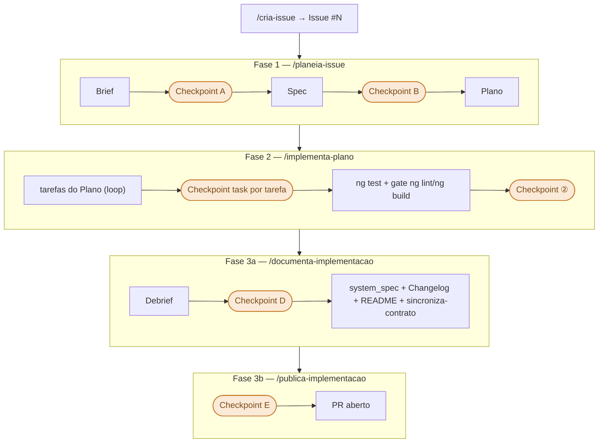

# Workflow deste repositório

> Como este repositório é desenvolvido com apoio de IA: comandos, skills e agentes, e a
> sequência das fases de uma issue. Para o detalhe de cada comando, abrir o ficheiro
> correspondente em `.claude/commands/`.
>
> O workflow é o mesmo de todos os repos do projeto (fonte canónica: backend Laravel),
> com as **ações específicas do Angular** — testes com `ng test`, qualidade com `ng lint` +
> `ng build`, documentação via MCP `angular`, e o contrato consumido do backend (nunca autorado).
>
> Leitura sequencial: as **3 camadas** e as **skills** dão a base; `/mostra-workflow` orienta
> (onde estou / por onde começar); o **ciclo de uma issue** (comandos por fase → grafo →
> checkpoints) é o trabalho em si; `/ajusta-workflow` fecha, corrigindo o próprio processo.

## Topologia dos repositórios

FinDocProcessor é multi-repo. Ao portar workflow/regras/`system_spec` para este repo, adaptar **sempre
do repo Laravel** (canónico) — manter conceitos/regras idênticos, só tornar as ações específicas de
Angular (ex: `ng test` em vez de `php artisan test`).

| Repo                              | Papel                                                                          |
| --------------------------------- | ------------------------------------------------------------------------------ |
| `findocprocessor-backend-laravel` | **Canónico** — fonte do workflow, das regras e do `openapi.yaml` (o contrato). |
| `findocprocessor-frontend`        | Este repo (Angular 22). Consome o contrato do backend; nunca o inventa.        |

## As 3 camadas

```
Commands  → o que o utilizador invoca (/planeia-issue, /implementa-plano, ...)
Skills    → passos reutilizáveis que os commands chamam (escreve-brief, executa-testes, ...)
Agents    → subagentes lançados por commands/skills quando a tarefa justifica (Explore, Plan)
```

- **Commands** (`.claude/commands/*.md`) — pontos de entrada com `$ARGUMENTS`, pré-condições e
  passos. Correspondem a uma fase do workflow (ver tabela abaixo).
- **Skills** (`.claude/skills/*.md`) — unidades de trabalho reutilizadas por vários commands
  (ex: `executa-testes`, `pausa-checkpoint`, `regista-aviso`). Não são invocadas diretamente
  pelo utilizador — os commands chamam-nas internamente.
- **Agents** — subagentes (Explore, Plan, general-purpose) lançados quando a tarefa beneficia
  de investigação paralela ou isolamento de contexto.

O estado entre fases persiste em `docs/workflow-state.md` (existe só enquanto uma issue está
em curso) e avisos de processo em `docs/process-warnings.md` (só entradas ativas —
`PENDENTE`/`PARCIALMENTE RESOLVIDO`).

## Skills

Skills de workflow (invocadas internamente pelos commands, não pelo utilizador):

| Skill                       | Propósito                                                                                |
| --------------------------- | ---------------------------------------------------------------------------------------- |
| `escolhe-issue`             | Selecciona automaticamente a próxima issue pronta a implementar                          |
| `escreve-brief`             | Expande a Issue num Brief estruturado                                                    |
| `escreve-spec`              | Traduz o Brief em requisitos técnicos verificáveis                                       |
| `escreve-plan`              | Decompõe a Spec em tarefas concretas e commitáveis                                       |
| `executa-testes`            | Executa a suite de testes (`ng test --watch=false`, Vitest), com auto-retry até 3x       |
| `executa-triagem-semantica` | Revisão semântica — nomenclatura, legibilidade, conformidade (Standalone/OnPush/Signals) |
| `sincroniza-contrato`       | Regenera os tipos a partir do `openapi.yaml` do backend + deteta drift                  |
| `pausa-checkpoint`          | Pausa o fluxo e aguarda resposta com conteúdo do utilizador                              |
| `propoe-commit`             | Formata e propõe commit em conventional commits (PT, emoji)                              |
| `regista-aviso`             | Regista erro/anomalia de processo em `process-warnings.md`                               |
| `escreve-debrief`           | Gera o Debrief a partir do git log e diff                                                |
| `atualiza-spec`            | Atualiza `docs/system_spec/` com base no Debrief                                        |
| `atualiza-changelog`       | Adiciona entrada ao `CHANGELOG.md` (Keep a Changelog)                                    |
| `atualiza-readme`          | Atualiza o `README.md` se a implementação expõe rotas/stack/uso                         |
| `propoe-pr`                 | Cria o PR no GitHub após confirmação (Checkpoint E)                                      |

> `angular-best-practices`/`vitest-testing` também vivem em `.claude/skills/` mas são skills de
> conhecimento de domínio — auto-ativadas pela IA ao escrever código/testes Angular, fora
> do fluxo Commands → Skills → Agents acima. Ambas declaram a pré-condição MCP `angular`
> (`get_best_practices` + `search_documentation`).

## Consultar o estado — `/mostra-workflow`

Antes de começar, ou ao retomar após uma pausa, `/mostra-workflow` diz em que ponto está o
trabalho: a fase atual, a issue em curso, os artefactos já produzidos e os avisos de processo
ativos. É **transversal** — invocável em qualquer momento, sem consumir nem avançar uma fase.
Sem sessão em curso, aponta o próximo passo (`/cria-issue`).

```
> /mostra-workflow

⚠️ Sessão em curso detetada

Issue:    #12 — tabela-documentos
Branch:   feat/tabela-documentos
Fase:     implementa
Próximo:  implementar tarefa 3 de 5 — /implementa-plano

Artefactos produzidos:
  Brief:   docs/briefs/2026-07-27-tabela-documentos.md   ✅ existe
  Spec:    docs/specs/2026-07-27-tabela-documentos.md     ✅ existe
  Plano:   docs/plans/2026-07-27-tabela-documentos.md     ✅ existe
```

## Comandos por fase

O ciclo de uma issue percorre estes comandos, do primeiro ao último:

| Command                         | Fase    | Produz                                              |
| ------------------------------- | ------- | --------------------------------------------------- |
| `/cria-issue <descrição>`       | —       | Issue #N no GitHub                                  |
| `/planeia-issue [#N]`           | Fase 1  | Brief + Branch + Spec + Plano                       |
| `/implementa-plano [#N]`        | Fase 2  | Código + Commits                                    |
| `/documenta-implementacao [#N]` | Fase 3a | Debrief + system_spec + Changelog + README (+ sync) |
| `/publica-implementacao [#N]`   | Fase 3b | PR no GitHub                                        |

## Sequência de uma issue



> Detalhe de cada checkpoint na tabela "Checkpoints humanos" abaixo; estado persiste em
> `workflow-state.md` por fase e é removido por `/publica-implementacao` no fecho.

## Checkpoints humanos

Nenhuma fase avança sem uma pausa explícita para decisão/validação do utilizador — a skill `pausa-checkpoint`
implementa os tipos abaixo e **nunca aceita "sim" isolado** como resposta suficiente; exige
conteúdo que demonstre compreensão real da decisão.

| Checkpoint | Quando                                      | O que confirma                                                                                                                             |
| ---------- | ------------------------------------------- | ------------------------------------------------------------------------------------------------------------------------------------------ |
| **A**      | Após o Brief (`/planeia-issue`)             | O que muda, que risco existe, que camada é mais afetada — nas palavras do utilizador. Bloqueia a Spec enquanto houver questões em aberto. |
| **B**      | Após a Spec (`/planeia-issue`)              | Spec verificada contra a seção Arquitetura do `CLAUDE.md` — desvios e violações de "O que NÃO fazer" listados antes de confirmar.        |
| **task**   | Após cada tarefa (`/implementa-plano`)      | Ficheiros alterados lidos pelo utilizador; só depois o commit é proposto (`propoe-commit`) e executado — nunca automático.                 |
| **②**      | Após todas as tarefas (`/implementa-plano`) | Resumo por ficheiro + `ng test` + gate `ng lint`/`ng build`, antes de avançar para a documentação.                                         |
| **D**      | Após o Debrief (`/documenta-implementacao`) | O porquê de cada decisão tomada na issue — em especial as não óbvias — antes de propagar para o `system_spec`.                             |
| **E**      | Antes do PR (`/publica-implementacao`)      | Capacidade de defender cada decisão do PR body perante um revisor.                                                                         |

Este é o mecanismo concreto de supervisão sobre trabalho gerado por IA neste repositório:
nenhum commit, alteração ao `system_spec` ou PR acontece sem uma decisão explícita e justificada
num destes pontos — não uma aprovação genérica.

## Contrato da API — backend-first

O frontend **consome** o contrato; nunca o autora. A fonte de verdade é o `openapi.yaml` do backend
Laravel. Quando uma issue consome rotas/models/enums novos, o contrato prepara-se **primeiro** no
backend e depois entra aqui via `npm run sync:contract` (skill `sincroniza-contrato`, corrida na
Fase 3a). Detalhe: `docs/system_spec/02-shared/contrato-api.md`.

## Ajustar o processo — `/ajusta-workflow`

Quando algo no workflow falhou, foi esquecido, ou uma convenção melhorou, `/ajusta-workflow`
**classifica** a natureza da mudança e aplica-a no local certo — nunca a despeja em `CLAUDE.md`
ou na memória. Como `/mostra-workflow`, é **transversal** (invocável em qualquer momento) e
fecha frequentemente um aviso pendente (`WRN-NNN`) de `docs/process-warnings.md`.

O comando classifica cada ajuste num destes tipos e daí deriva o destino:

| Tipo  | Natureza da mudança                                                                            | Destino                                  |
| ----- | ---------------------------------------------------------------------------------------------- | ---------------------------------------- |
| **A** | Instrução de agente / comportamento de workflow — como o agente age, checkpoints, sequência, quando perguntar/parar | `.claude/commands/` ou `.claude/skills/` |
| **B** | Conhecimento estrutural da aplicação — padrões arquiteturais, contratos, ciclos de estado, como o sistema funciona | `docs/system_spec/` (seção relevante)   |
| **C** | Convenção de codificação — naming, tipagem, estrutura de ficheiros que todo o código de domínio segue | `docs/system_spec/02-shared/`            |
| **D** | Misto — componentes em múltiplos locais                                                        | combinação dos acima                     |

> `CLAUDE.md` é destino de **último recurso** — só para comportamento do agente que não caiba em
> commands/skills.

**Exemplo:**

```
> /ajusta-workflow falta cobertura de testes configurada no ng test

→ Tipo C/B: convenção de qualidade → CLAUDE.md (gates de CI) + system_spec/07-testing.md
→ Aplicado em CLAUDE.md e docs/system_spec/07-testing.md
→ WRN-001 marcado STATUS: RESOLVIDO em docs/process-warnings.md
```
